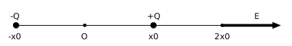

### Question-

	A charge distribution has the charge density given by \(\rho = Q\{\delta(x-x_0)-\delta(x+x_0)\}\). For this charge distribution, the electric field at \((2x_0,0,0)\)
	  
	 a) \({2Q \hat x} \over {9 \pi \epsilon_0 x_0^2}\)
	 &emsp;&emsp;&emsp;&emsp; b) \({Q \hat x} \over {4 \pi \epsilon_0 x_0^3}\)
	 &emsp;&emsp;&emsp;&emsp; c) \({Q \hat x} \over {4 \pi \epsilon_0 x_0^2}\)
	 &emsp;&emsp;&emsp;&emsp; d) \({Q \hat x} \over {16 \pi \epsilon_0 x_0^3}\)
	   

---

 
### Answer-

	
 Answer 

	 
	 &emsp; a) \({2Q \hat x} \over {9 \pi \epsilon_0 x_0^2}\)
	  

<ddetails>
	
 Step-by-Step Solution 

	 
		The charge density is \(\rho = Q\{\delta(x-x_0)-\delta(x+x_0)\}\), which means, there are two point charges. One is at \(x-x_0=0 \ i.e. \ x=x_0\) with charge +Q and another at \(x+x_0=0 \ i.e. \ x=-x_0\) with charge -Q.We have to find electric field at \(x=2x_0\).
	 
	
 	

	 
	&emsp; The electric field at \(x=2x_0\) is the vector addition of electric fields due to these individual charges. For both these charges, the electric field is along x-axis.
		
	  
</ddetails>
---